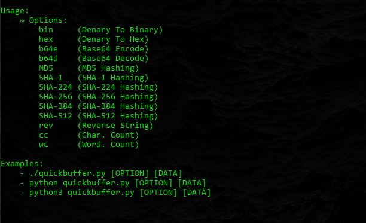

## QuickBuffer

*Usage:*

- `python3 quickbuffer.py [OPTION] [DATA]` 🚀

> 

*Options:*

- bin     `(Denary To Binary)`
- hex     `(Denary To Hex)`
- b64e    `(Base64 Encode)`
- b64d    `(Base64 Decode)`
- MD5     `(MD5 Hashing)`
- rot13   `(Rot13 Encoding)`
- SHA-1   `(SHA-1 Hashing)`
- SHA-224 `(SHA-224 Hashing)`
- SHA-256 `(SHA-256 Hashing)`
- SHA-384 `(SHA-384 Hashing)`
- SHA-512 `(SHA-512 Hashing)`
- rev     `(Reverse String)`
- cc      `(Char. Count)`
- wc      `(Word. Count)`
